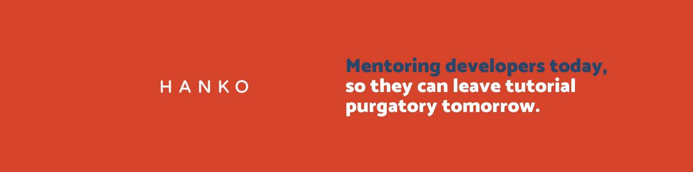

# Werdd

## Description
The Werdd app is an app made for those who want new words added to their vocabulary, as well as having a dictionary available in their pocket at all times!  
This repo exists as a reference for Hanko Academy students as they build their own versions of the Werdd app (or any name decided by the student). Guides have created their implementation of the Werdd app which is broken down week by week in branches starting with v1

## What you'll learn
* UIKit views and controls
* UITableViews
* UICollectionViews
* Navigation Stack
* Reusable views through subclassing
* Networking and APIs
* Persistence using Core Data
* Design Patterns

## Spec
Design specs available on [Figma](https://www.figma.com/file/0PAmaT9MU2bhfM8ef0zBVE/Practice-Project-Designs?node-id=1508%3A4430)

## Setup
Clone main and checkout the branches starting with v1 to view each week's completed version.
